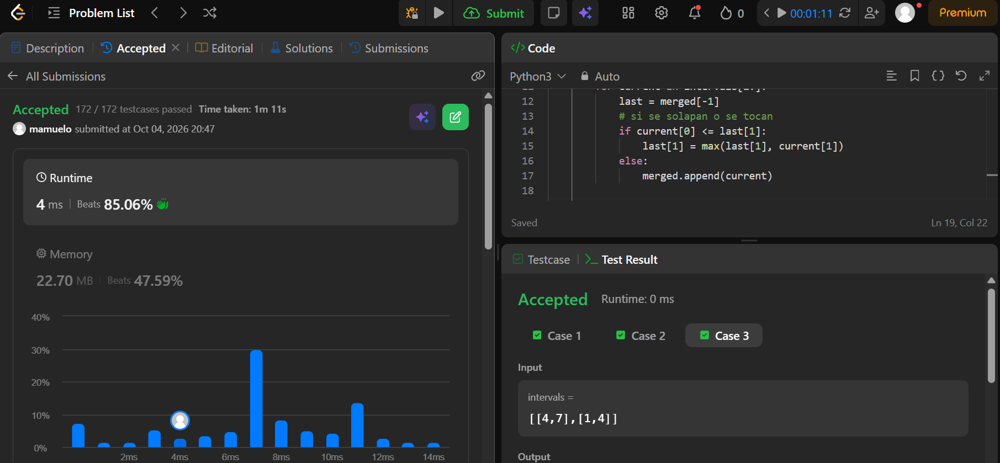
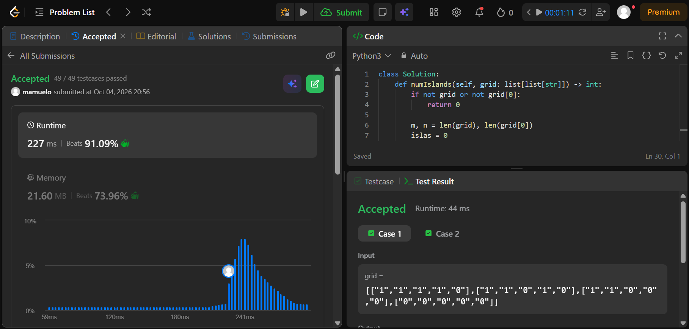
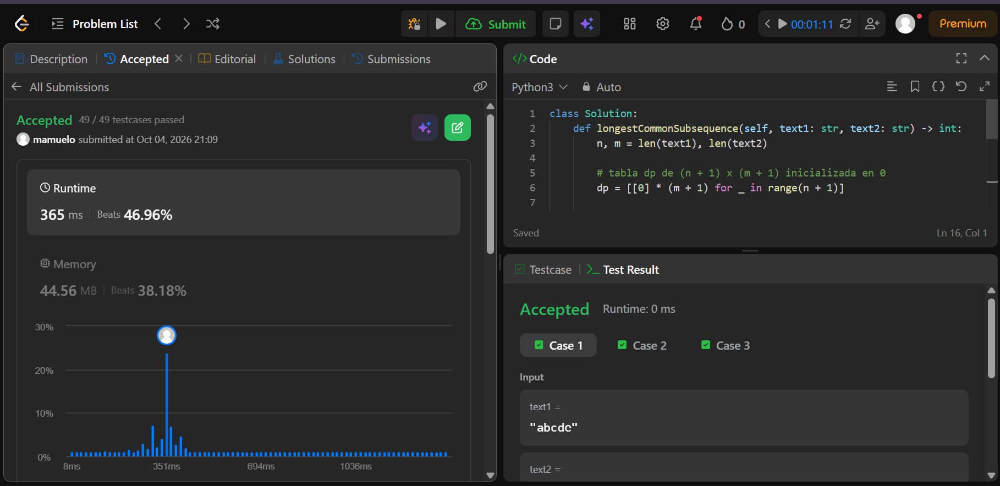
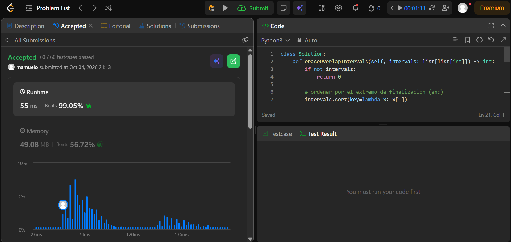
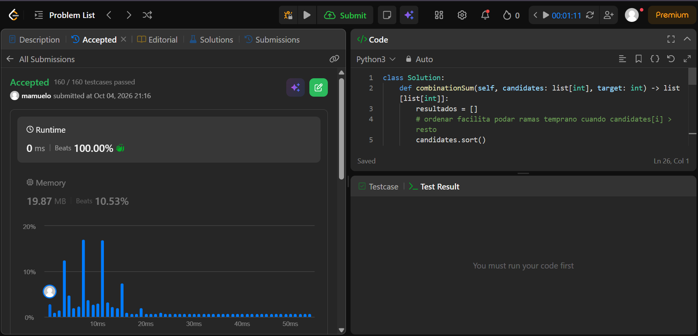

# Taller - Analisis de Algoritmos

Repositorio con las soluciones a los ejercicios del taller de analisis de algoritmos.

---

## Ejercicios

### Ejercicio 1: Merge Intervals

- Enlace: [56. Merge Intervals](https://leetcode.com/problems/merge-intervals/)
- Carpeta: [./56-merge-intervals/](./56-merge-intervals/)
- Familia: Ordenamiento (Sorting)
- Idea: Se ordenan los intervalos segun su punto de inicio (start). Luego se recorren de izquierda a derecha con un acumulador: si el siguiente intervalo arranca antes o justo cuando termina el actual, se ensancha el final tomando el maximo; si no se solapan, se cierra el actual y se agrega el siguiente.
- Complejidad:
  - Tiempo: O(n log n), donde n es la cantidad de intervalos. El ordenamiento inicial domina el tiempo, ya que la fusion lineal posterior solo toma O(n).
  - Espacio: O(n), donde n es el numero de intervalos para almacenar la lista resultante fusionada (mas el espacio interno que requiera el algoritmo de sort).
- Evidencia de Accepted:
  

### Ejercicio 2: Number of Islands

- Enlace: [200. Number of Islands](https://leetcode.com/problems/number-of-islands/)
- Carpeta: [./200-number-of-islands/](./200-number-of-islands/)
- Familia: Grafos (Componentes conexas / DFS)
- Idea: El grafo esta implicito en la grilla donde cada celda con '1' es un vertice y tiene aristas no dirigidas con sus vecinas ortogonales (arriba, abajo, izquierda, derecha). Se recorre la matriz y al encontrar un '1' se suma una isla y se lanza un DFS para recorrer y marcar ("hundir") toda la componente conexa.
- Complejidad:
  - Tiempo: Theta(m * n), donde m es el numero de filas y n el de columnas. Cada celda se visita una cantidad constante de veces.
  - Espacio: O(m * n) en el peor caso para la pila de recursion si toda la grilla es tierra.
- Evidencia de Accepted:
  

### Ejercicio 3: Longest Common Subsequence

- Enlace: [1143. Longest Common Subsequence](https://leetcode.com/problems/longest-common-subsequence/)
- Carpeta: [./1143-longest-common-subsequence/](./1143-longest-common-subsequence/)
- Familia: Programacion Dinamica (DP)
- Idea: Se construye una tabla de prefijos donde dp[i][j] guarda el LCS de text1[0..i) y text2[0..j). Si los caracteres coinciden (text1[i-1] == text2[j-1]), se suma 1 a la diagonal previa; si difieren, se toma el maximo entre descartar el caracter de una u otra cadena (max(dp[i-1][j], dp[i][j-1])).
- Complejidad:
  - Tiempo: Theta(n * m), donde n es la longitud de text1 y m la de text2, al llenar la tabla con operaciones O(1) por celda.
  - Espacio: Theta(n * m) para almacenar la matriz de dimensiones (n + 1) x (m + 1).
- Evidencia de Accepted:
  

### Ejercicio 4: Non-overlapping Intervals

- Enlace: [435. Non-overlapping Intervals](https://leetcode.com/problems/non-overlapping-intervals/)
- Carpeta: [./435-non-overlapping-intervals/](./435-non-overlapping-intervals/)
- Familia: Greedy (Voraz / Seleccion de actividades)
- Idea: Minimizar los intervalos a borrar equivale a maximizar los intervalos compatibles que se quedan. Se ordenan los intervalos por su tiempo de finalizacion (end) y se selecciona vorazmente el que termine mas temprano; si el siguiente inicia antes de que termine el ultimo aceptado, se descarta (se suma a los borrados).
- Complejidad:
  - Tiempo: O(n log n), donde n es el numero de intervalos, determinado por el ordenamiento inicial (el recorrido voraz posterior es O(n)).
  - Espacio: O(1) auxiliar si se ordena sobre el mismo arreglo (u O(n) segun la memoria interna del sort de Python).
- Evidencia de Accepted:
  

### Ejercicio 5: Combination Sum

- Enlace: [39. Combination Sum](https://leetcode.com/problems/combination-sum/)
- Carpeta: [./39-combination-sum/](./39-combination-sum/)
- Familia: Backtracking (Busqueda exhaustiva con poda)
- Idea: Se genera el arbol de combinaciones seleccionando en cada llamada un candidato candidates[i] desde el indice actual en adelante (evitando permutaciones repetidas). Se resta su valor de target y se permite volver a usarlo; si target llega a 0 se guarda una copia de la combinacion, si es negativo se poda, y al retornar se deshace la eleccion con pop() para explorar la siguiente alternativa.
- Complejidad:
  - Tiempo: O(n^(t / min_val)), donde n es la cantidad de candidatos, t es target y min_val es el valor del menor candidato, lo cual marca la altura maxima del arbol de busqueda.
  - Espacio: O(t / min_val) para la profundidad de la pila de recursion y la lista temporal de la combinacion (mas la memoria para almacenar la respuesta).
- Evidencia de Accepted:
  

---

## Ejemplo de como incrustar la evidencia en Markdown

Para agregar los screenshots de los ejercicios aceptados en LeetCode, se guarda la imagen en la carpeta correspondiente y se referencia de forma relativa asi:

```markdown

```
